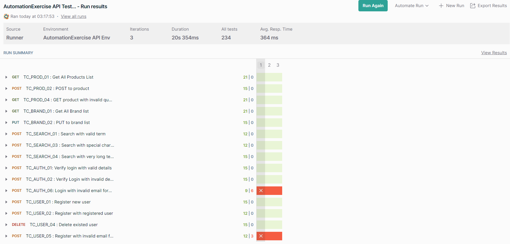
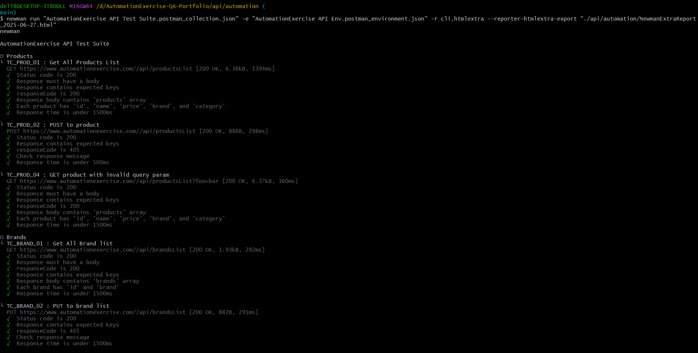

# API Automation

This folder hosts all automated API testing artifacts for AutomationExercise.

## Contents

- Postman collection files (`AutomationExercise API Test_Suite.postman_collection.json`) containing the API test suites.
- Environment configuration files (`Automationexercise API Env.postman.environment.json`) to parameterize test runs.
- Scripts such as `run_tests.bat` for running tests locally.
- Generated test reports (excluded from version control via `.gitignore`).

## Overview

Automated API tests provide fast, repeatable validation of critical API endpoints, improving test coverage and accelerating feedback loops.

## How to Run Tests

### Using the Batch File (Windows)

1. Navigate to this folder (`api/automation/`).
2. Double-click `run_tests.bat` to execute the Postman API test suite.
3. View the HTML report generated in this folder, usually `report.html`.

### Using Newman CLI Directly

If you prefer to run tests manually using Newman, execute this command in your terminal:

```bash
newman run AutomationExercise_API_Test_Suite.postman_collection.json \
  -e Automationexercise_API_Env.postman_environment.json \
  -r cli,html \
  --reporter-html-export report.html


## ⚠️ Known Backend Behavior – Invalid Email Registration Discrepancy

### Test Case: TC_USER_05 – Register with Invalid Email Format

- When running the Postman collection via **Newman**, submitting an invalid email (e.g., `johndoe1`, `hellspan2`) repeatedly returns:

  > **"email already exists"**

- However, when sending the **same invalid email request manually in Postman**, the API returns:

  > **`201 Created`** — user account is created successfully.

- **Note:**  
  Accounts created with these invalid emails (missing “@” and domain) **cannot be deleted** via the API.

### Implications

- The backend **does not validate email formats properly**, allowing creation of accounts with malformed emails.  
- The discrepancy between Newman and Postman results occurs because Newman hits the “already exists” condition on subsequent runs, but manual testing appears to create accounts without consistent validation.  
- This inconsistency indicates a backend data or caching issue affecting automated runs differently.

### Handling in Automation

- Tests must be aware of this behavior and interpret “email already exists” responses as valid for repeated runs.  
- Test data cleanup or dynamic email generation is recommended to avoid duplicates and false failures.

### Conclusion

This is a backend validation and data consistency issue, **not a fault in the automation scripts**. The `.bat` file is useful and recommended for easy automation runs despite fixed-email “email already exists” messages. Those messages reflect backend state, not a problem with automation or the batch script.


## 📸 Screenshots

### 1️⃣ Postman Manual Run



### 2️⃣ Newman Automated Run

  
  

