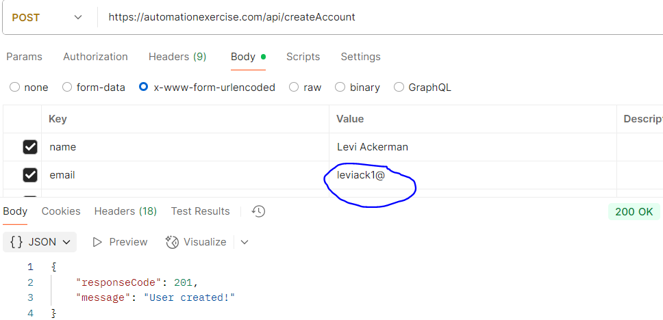
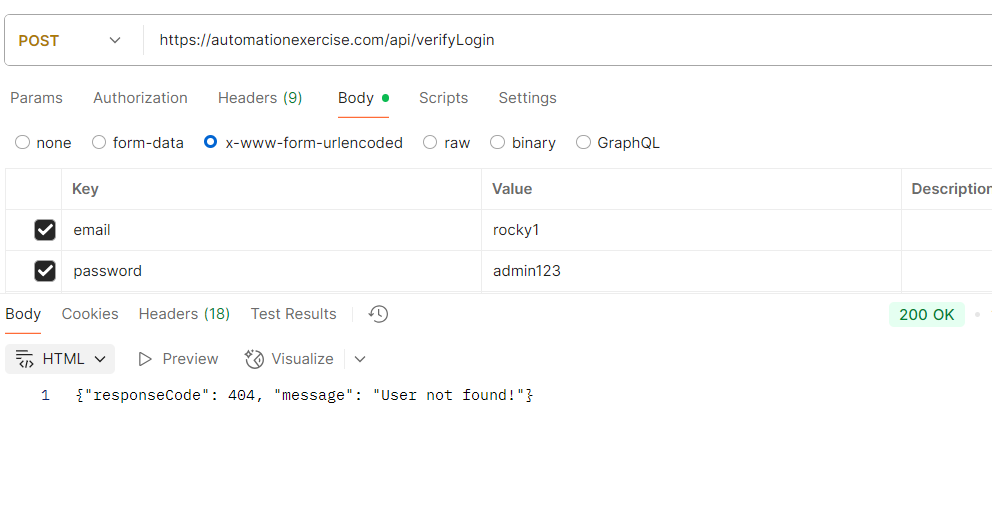
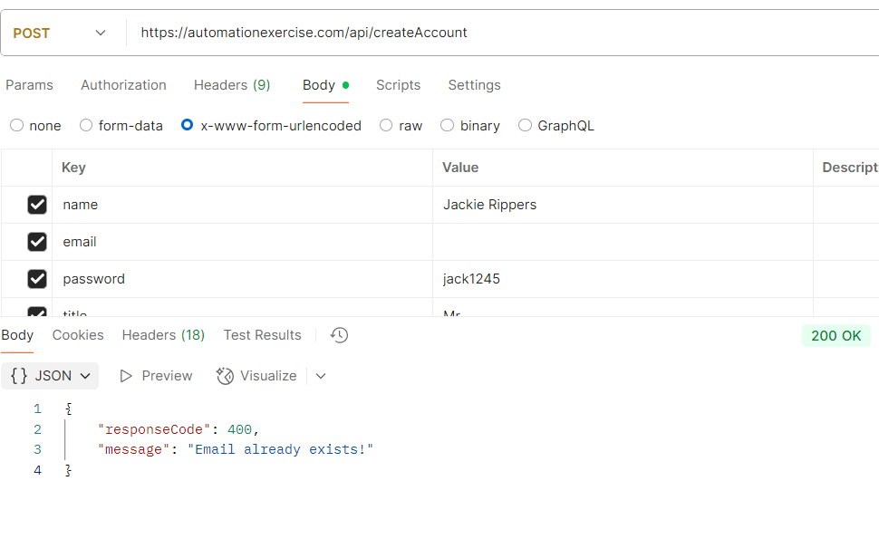
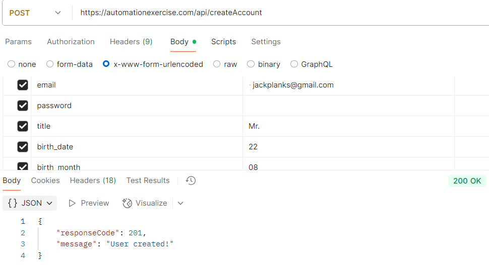

# 🐞 Bug Reports – API Testing

This document captures all the bugs found during manual and exploratory API testing on [AutomationExercise.com](https://automationexercise.com). Each bug is linked to a screenshot located in the `screenshots/` folder for easy reference.

---

> ⚠️ **Important:** The API always returns HTTP status 200 OK even for error responses.  
> The actual response status is inside the JSON field `responseCode`.  
> All test validations are done based on `responseCode` values.

---

## ❌ Issues Found During Test Case Execution

---

### ❌ Bug 1 – Invalid Email Format Accepted for Registration

- **Test Case:** `TC_USER_05`  
- **What I Did:** Tried to register a user with an invalid email format (`leviack1@`).  
- **Steps to Reproduce:**
  1. Send a POST request to `/api/createAccount`.
  2. Use an invalid email format such as `leviack1@` in the JSON body.  
- **What I Expected:** API should return a `400 Bad Request` error, stating that the email format is invalid.  
- **What Actually Happened:** The API returned a `201 Created` status and a message saying user created.  
- **Severity:** Medium  
- **Current Status:** Open  
- 📸 **Screenshot:**  
  

---

### ❌ Bug 2 – Invalid Email Format Not Validated in Login

- **Test Case:** `TC_AUTH_06`  
- **What I Did:** Tried to log in using an email without proper format (missing `@domain.com`).  
- **Steps to Reproduce:**
  1. Send a `POST` request to `/api/verifyLogin`.
  2. Use an invalid email like `"rocky1"` and a dummy password.
  3. Observe the response.
- **What I Expected:** API should return `400 Bad Request` with a message like `"Invalid email format"` or `"Email must be valid"`.  
- **What Actually Happened:** API returned `200 OK` with `responseCode: 404` and message `"User not found"`.
- **Severity:** Medium  
- **Issue Type:** Validation – Improper input handling  
- **Current Status:** Open  
- 📸 **Screenshot:**  
  

---

## 🧪 Exploratory Testing – Additional Bugs

---

### 🔍 Bug 3 – Register API Accepts Missing Email But Returns HTTP 200 OK

- **What I Tried:** Sent a registration request without the `email` field after previously registering another user.  
- **Steps to Reproduce:**
  1. Register a valid user via `/api/createAccount`.
  2. Then send a POST request with different name and password, but with the `email` field **missing** or blank.
  3. Check the HTTP response and body.  
- **Expected:** API should return an HTTP status code `400 Bad Request` with a message like `"Email is required"`.  
- **Actual:** API returned **HTTP `200 OK`**, but inside the body, the `responseCode` was `400`, and the message was `"User already exists"`.  
- **Severity:** Medium  
- **Issue Type:** Validation + Status Code Mismatch  
- **Current Status:** Open  
- 📸 **Screenshot:**  
  

---

**🧠 Notes:**  
This bug shows that the API does not respect proper HTTP status conventions. Returning `200 OK` with a body indicating failure (`responseCode: 400`) is misleading and breaks API contract expectations. It may cause issues in frontend or automated systems expecting correct status codes.

---

### ❌ Bug 4 – Registration Succeeds Without Password

- **Test Case:** `TC_USER_06` (Extended Exploratory Variation)  
- **What I Did:** Sent a registration request with only the email field and no password or name.  
- **Steps to Reproduce:**
  1. Send a `POST` request to `/api/createAccount`.
  2. Provide only an `email` (e.g., `"jackplanks@gmail.com"`), omit `password` and `name`.
  3. Observe the response.
- **What I Expected:** API should return a `400 Bad Request` with an error like `"Password is required"`.  
- **What Actually Happened:** API returned `200 OK`, and user was created (success message).  
- **Severity:** High – registration without password is a critical security risk  
- **Current Status:** Open  
- 📸 **Screenshot:**  
  

---

**🧠 Notes:**  
This was discovered while testing TC_USER_06. The API lacks validation for the `password` field. Allowing user registration without a password breaks core authentication logic and introduces security vulnerabilities.

---

## 📌 Summary

| Category                | Number of Bugs |
|-------------------------|---------------:|
| Test Case Failures      | 2              |
| Exploratory Bugs        | 2              |
| **Total Open Bugs**     | **4**          |

---
