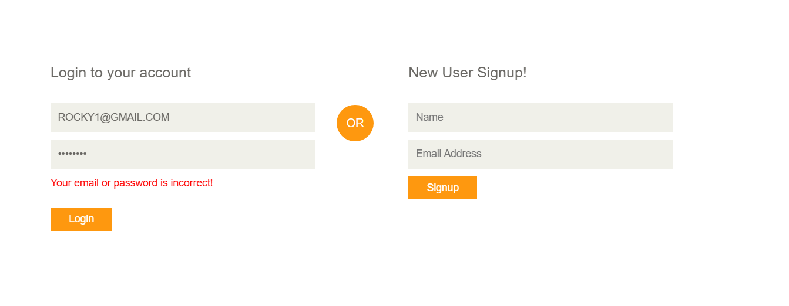
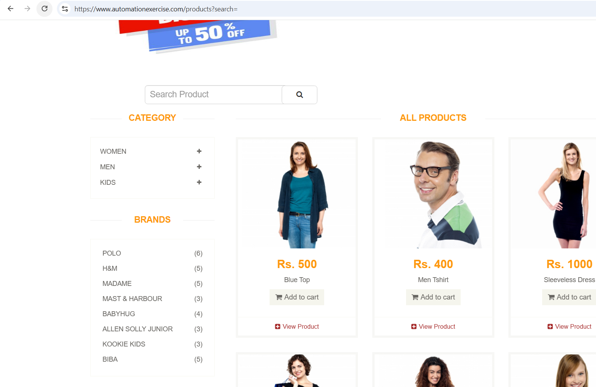
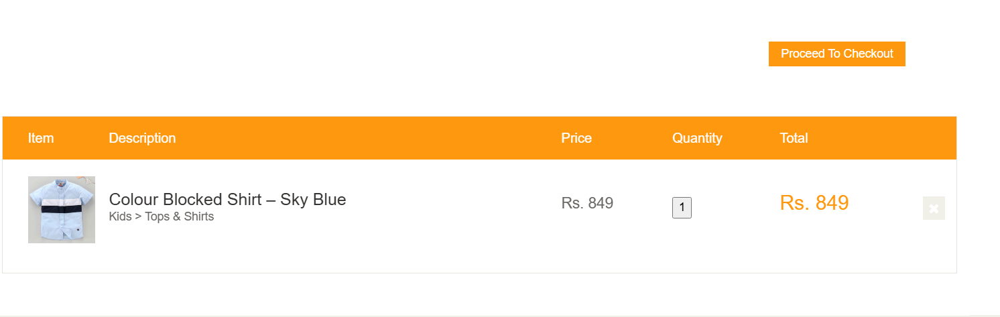
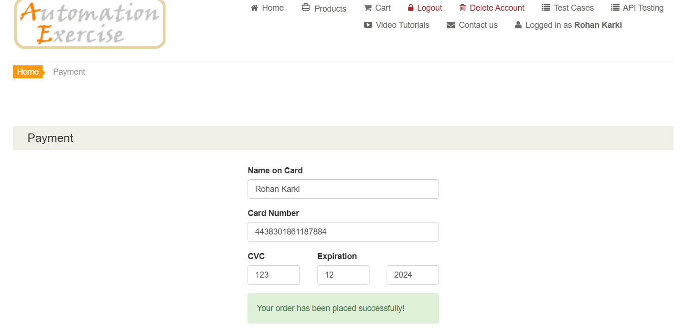
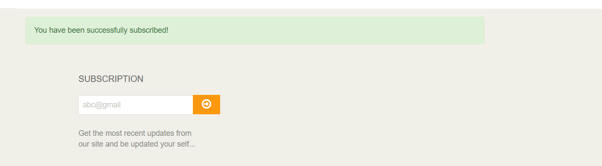
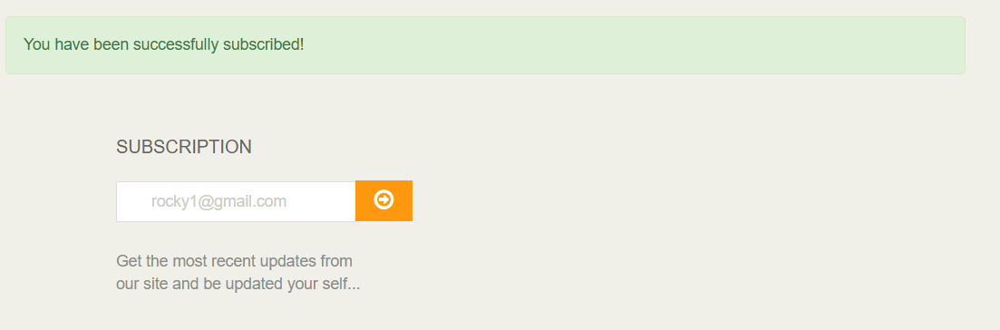
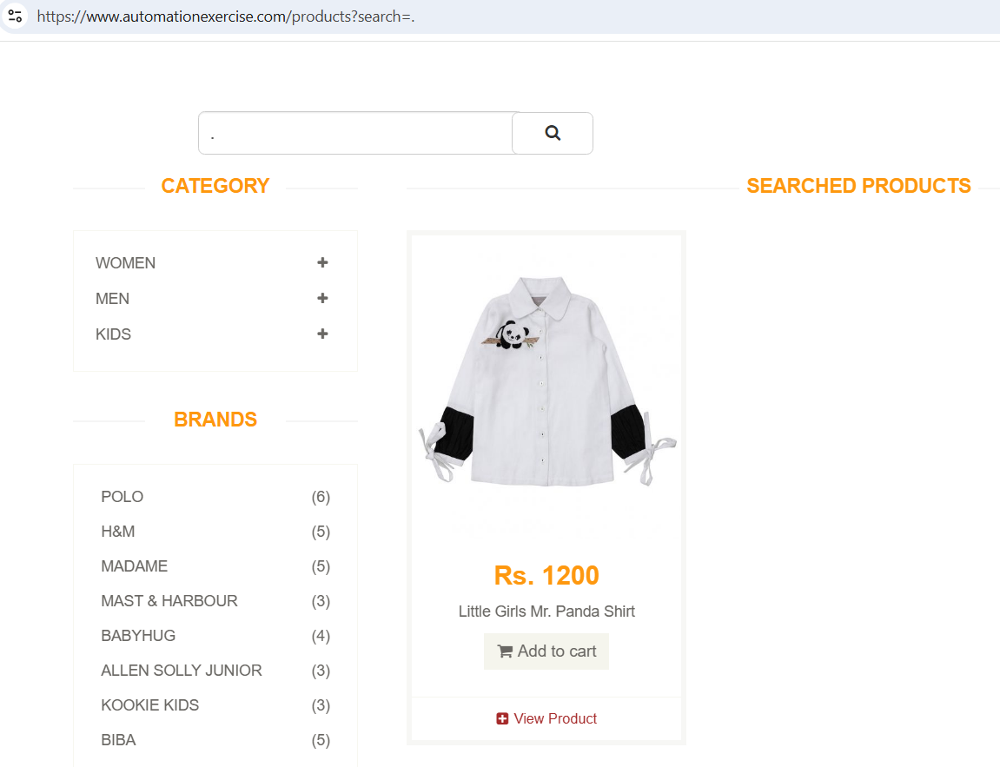

# 🐞 Bug Reports

This document captures all the bugs found during manual testing and exploratory testing on [AutomationExercise.com](https://automationexercise.com). Each bug is linked to a screenshot located in the `screenshots/` folder for easy reference.

---

## 🔴 Issues Found During Test Case Execution

---
### ❌ Bug 1 – Uppercase Email Subscription Not Allowed

- **Test Case:** TC_011  
- **What I Did:** Tried Login with uppercase email.  
- **Steps to Reproduce:**
  1. Scroll to the **Login** form.
  2. Enter an valid email in uppercase ( `ROCKY1@GMAIL.COM`).
  3. Click **Login**.  
- **What I Expected:** The system should accept it and showed a success message again.
- **What Actually Happened:** A message telling me this email or password is incorrect.  
- **Severity:** Medium 
- **Current Status:** Open  
- 📸 **Screenshot:**  
  

---

### ❌ Bug 2 – Search With Empty Input

- **Test Case:** TC_020  
- **What I Did:** Tried to search without typing anything.  
- **Steps to Reproduce:**
  1. Go to the Product page.
  2. Click the **Search** icon without entering any input.  
- **What I Expected:** A message asking me to enter a search term.  
- **What Actually Happened:** The page just refreshed silently, no message or prompt.  
- **Severity:** Medium  
- **Current Status:** Still open, needs fixing  
- 📸 **Screenshot:**  
  

---

### ❌ Bug 3 – Unable to Update Quantity in Cart

- **Test Case:** TC_025  
- **What I Did:** Tried changing the quantity of a product in the cart.  
- **Steps to Reproduce:**
  1. Add any product to the cart.
  2. Go to the **Cart** page.
  3. Hover over and click the quantity box to edit the quantity.  
- **What I Expected:** To be able to edit the quantity and see the total update.  
- **What Actually Happened:** The quantity box wasn’t editable at all.  
- **Severity:** High (affects checkout flow)  
- **Current Status:** Open  
- 📸 **Screenshot:**  
  

---

### ❌ Bug 4 – Checkout Accepts Expired Credit Card

- **Test Case:** TC_031  
- **What I Did:** Entered an expired credit card during checkout.  
- **Steps to Reproduce:**
  1. Add items to the cart and proceed to checkout.
  2. Enter expired card details (e.g., `01/22`) and click **Pay and Confirm Order**.  
- **What I Expected:** An error message about invalid or expired card.  
- **What Actually Happened:** Payment went through successfully, which shouldn’t happen.  
- **Severity:** High  
- **Current Status:** Open  
- 📸 **Screenshot:**  
  

---

### ❌ Bug 5 – Invalid Email Accepted for Subscription

- **Test Case:** TC_036  
- **What I Did:** Tried subscribing with an invalid email (like "abc@").  
- **Steps to Reproduce:**
  1. Scroll to the **Subscription** box in the footer.
  2. Enter `abc@` as the email.
  3. Click **Subscribe**.  
- **What I Expected:** To see a validation error and subscription blocked.  
- **What Actually Happened:** I got a success message even though the email was invalid.  
- **Severity:** Low  
- **Current Status:** Open  
- 📸 **Screenshot:**  
  

---

### ❌ Bug 6 – Duplicate Email Subscription Allowed

- **Test Case:** TC_039  
- **What I Did:** Tried subscribing again with an email that’s already subscribed.  
- **Steps to Reproduce:**
  1. Scroll to the **Subscription** box.
  2. Enter an already subscribed email (e.g., `user@gmail.com`).
  3. Click **Subscribe**.  
- **What I Expected:** A message telling me this email is already subscribed.  
- **What Actually Happened:** The system accepted it and showed a success message again.  
- **Severity:** Low  
- **Current Status:** Open  
- 📸 **Screenshot:**  
  

---

### ❌ Bug 7 – Subscription Email Field Accepts Leading/Trailing Spaces

- **Test Case:** TC_040  
- **What I Did:** Entered an email with spaces before and after it.  
- **Steps to Reproduce:**
  1. Go to the **Subscribe** section.
  2. Enter an email with spaces like `"  test@email.com  "` and click **Subscribe**.  
- **What I Expected:** The system should trim spaces or show an error.  
- **What Actually Happened:** The email was accepted as-is.  
- **Severity:** Low  
- **Current Status:** Open  
- 📸 **Screenshot:**  
  

---

## 🧪 Exploratory Testing – Additional Bugs

---

### 🔍 Bug 8 – Searching With “##” Resets Product List

- **What I Tried:** Entered `##@` in the search box.  
- **Steps to Reproduce:**
  1. Enter `##@` into the search bar.
  2. Click the **Search** button.  
- **Expected:** Either an error message or no search results.  
- **Actual:** The product list simply reset to the default view.  
- **Severity:** Medium  
- 📸 **Screenshot:**  
  

---

### 🔍 Bug 9 – Searching With Dot (“.”) Returns Irrelevant Product

- **What I Tried:** Searched using just a dot (`.`).  
- **Steps to Reproduce:**
  1. Enter `.` into the search field.
  2. Click the **Search** button.  
- **Expected:** No results or a validation error.  
- **Actual:** It returned a completely unrelated product.  
- **Severity:** Low  
- 📸 **Screenshot:**  
  

---

### 🔍 Bug 10 – Email Without “.com” Accepted

- **What I Tried:** Used an email missing the `.com` part during signup or subscription.  
- **Steps to Reproduce:**
  1. Enter an incomplete email like `user2@gmail` in the subscription/signup form.
  2. Click submit.  
- **Expected:** Validation error.  
- **Actual:** The system accepted it without complaint.  
- **Severity:** Medium  
- 📸 **Screenshot:**  
  

---

## 📌 Summary

| Category                | Number of Bugs |
|-------------------------|---------------:|
| Test Case Failures      | 7              |
| Exploratory Bugs        | 3              |
| **Total Open Bugs**     | **10**         |

---

